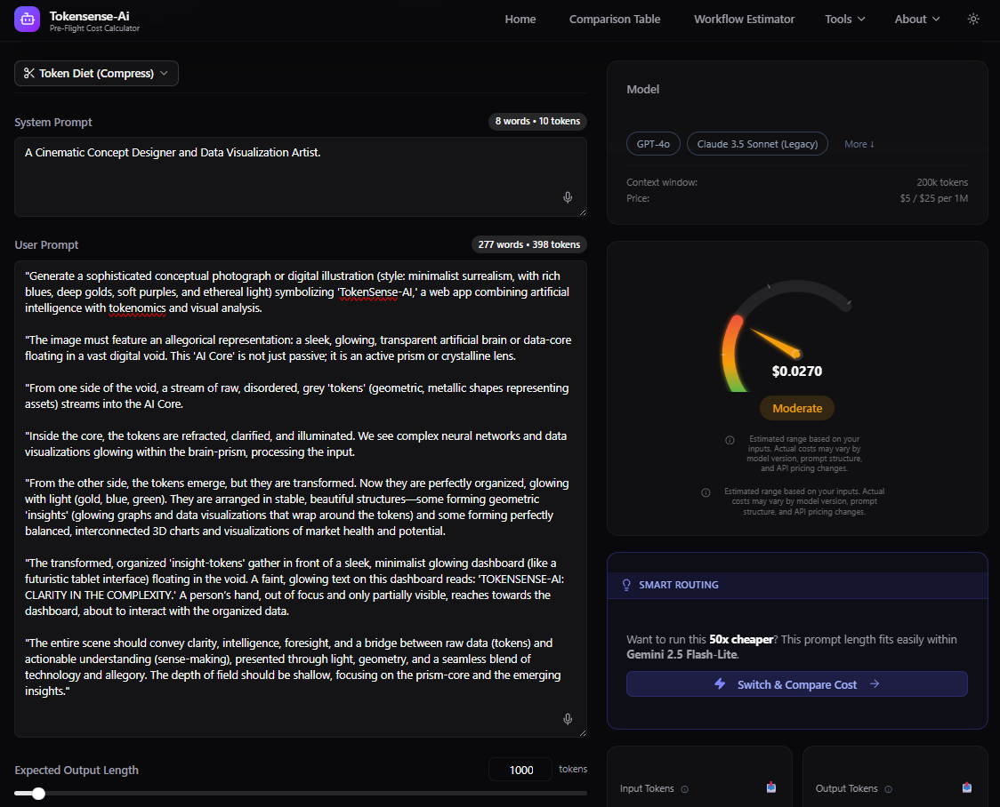
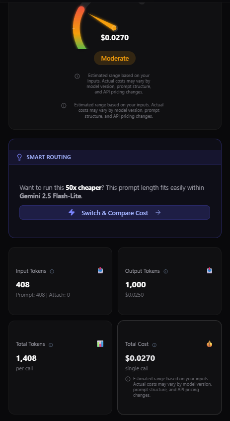
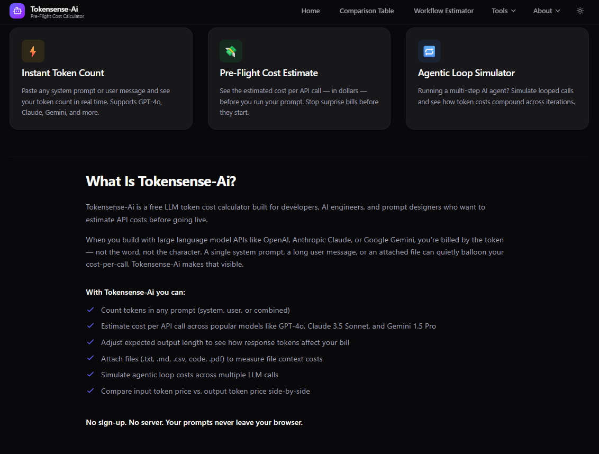

# TokenSense

## Tech Stack

### Frontend
[](https://nextjs.org/)
[](https://react.dev/)
[](https://www.typescriptlang.org/)
[](https://tailwindcss.com/)

### Mobile
[](https://flutter.dev/)

### Deployment & Infrastructure
[](https://netlify.com/)
[](https://github.com/)

### Tools & Services
[](https://analytics.google.com/)
[](https://lemonsqueezy.com/)

### Features


A free, open-source LLM token cost calculator for developers.

## Features
- Support for Claude, GPT, Llama, and more
- Real-time cost estimation
- Open-source with premium features via LemonSqueezy

## Demo



## Features
- Support for Claude, GPT, Llama, and more
- Real-time cost estimation

## More Screenshots





## Getting Started
```bash
npm install
npm run dev
```

## Tech Stack
- Next.js, Tailwind CSS.
  
## License
Apache 2.0 (open core)

## Contribute
See [CONTRIBUTING.md](./CONTRIBUTING.md)
```

**LICENSE** file
```
